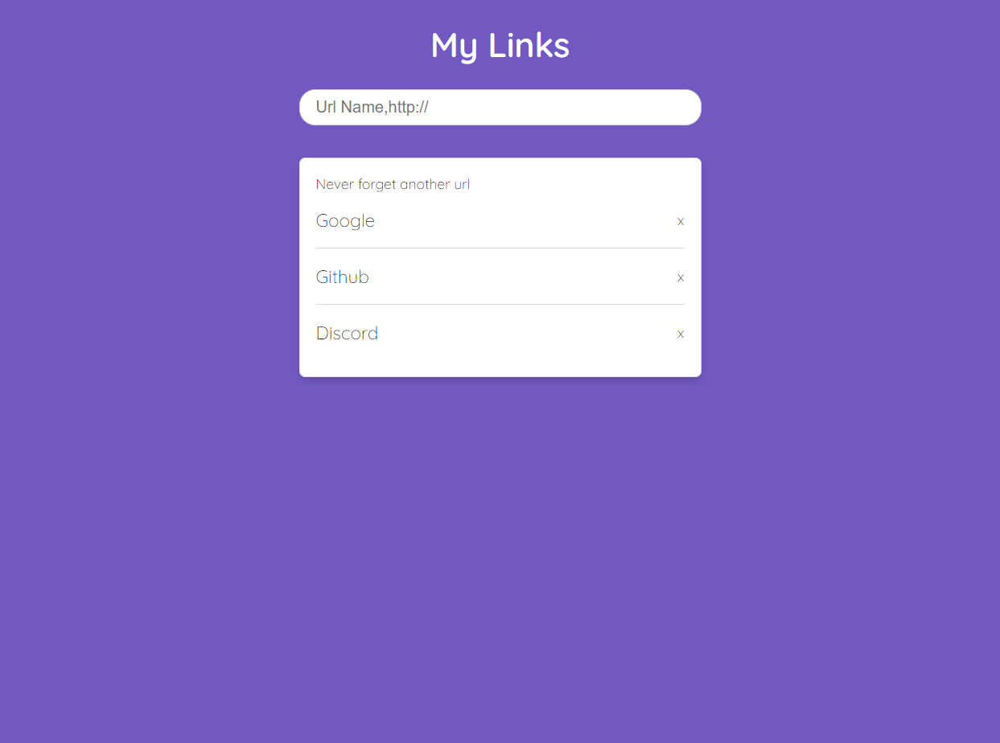

<h1 align="center">Http-node</h1>

Web application that list and save all of our favorite Links.🚀

    <a href="#-technologies">Technologies</a>&nbsp;&nbsp;&nbsp;|&nbsp;&nbsp;&nbsp;
    <a href="#-project">Project</a>&nbsp;&nbsp;&nbsp;|&nbsp;&nbsp;&nbsp;
    <a href="#-license">License</a>&nbsp;&nbsp;&nbsp;|&nbsp;&nbsp;&nbsp;
    <a href="#-contact">Contact</a>&nbsp;&nbsp;&nbsp;|&nbsp;&nbsp;&nbsp;
    <a href="#-contact">Documentation</a>

 

  

 

  

## 🚀 Technologies

This project was developed with the following technologies:

- Node.js
- JavaScript
- RESTful API
- http - node module
- url - node module
- fs - node module
- pash - node module
- http query
- Nodemon (devDependencies)
- HTML and CSS
- Git & GitHub

## 💻 Project

This project aims to create a complete environment that includes a server, a web frontend, and an API, all implemented using native Node.js modules. 
 

You can access the project online through [THIS LINK](https://thiagonevesalmeida.github.io/http-node/) 🚀.

## 📝 Licença

This project is under the MIT license.

## 📨 Contato

thiagonevesdealmeida@gmail.com

[linkedin.com/in/thiagonevesdealmeida](https://www.linkedin.com/in/thiagonevesdealmeida/) 

